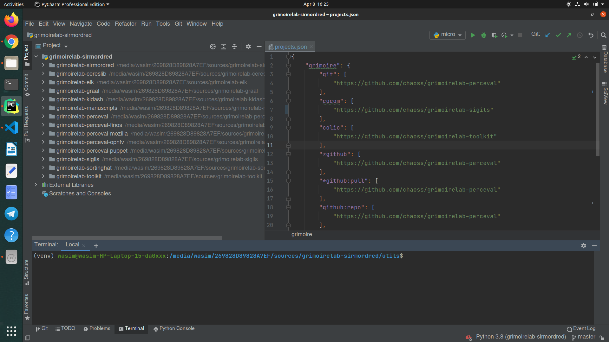

Microtask 1:
Set up a dev environment to work on GrimoireLab. Have a look at chaoss/grimoirelab-sirmordred - Getting-Started.md.

1. Got all the containers(ElasticSearch (6.8.6), Kibiter (6.8.6) and a MySQL/MariaDB database (5.7.24/10.0))
2. Run docker-compose

```
$ docker-compose up -d
```

3. Cloned all the Grimoirelab Components and set up their remotes.

4. Set up Pycharm

    - Installed the dependencies listed in each requirements.txt, excluding the ones concerning the grimoirelab components.
    - Dependencies added to the grimoirelab components via Project Structure.


